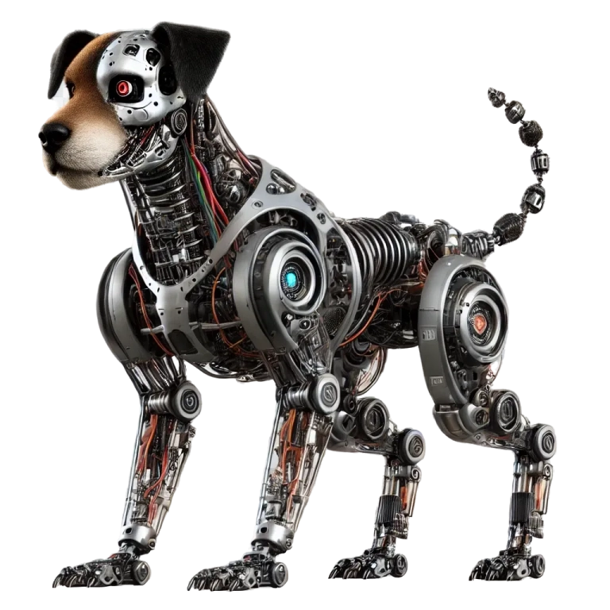

# hardware
This module is designed for building legged robots and manipulators, inspired by the Open Dynamic Robot Initiative's open_robot_actuator_hardware. It provides a flexible framework for developing dynamic robotic systems with advanced actuator control and modularity.

## Click the dog to view the latest assembly in your browser:

